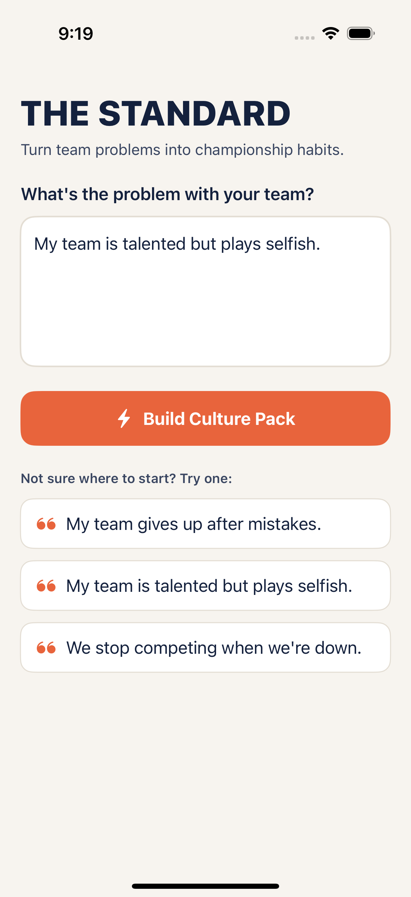
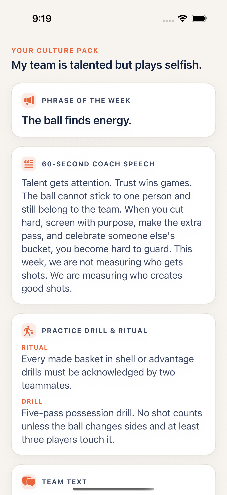
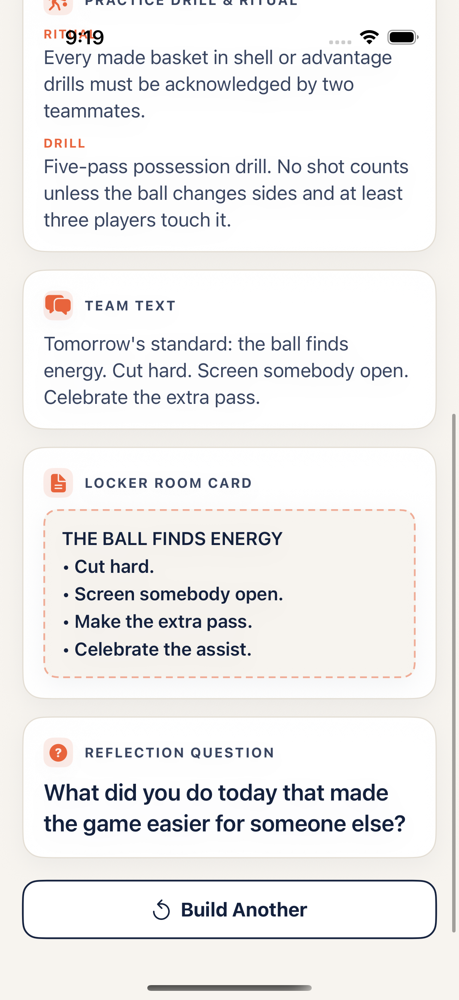

# The Standard

**Turn team problems into championship habits.**

Type your team problem and get the phrase, speech, drill, and weekly standard.
The Standard takes a single team problem — in the coach's own words — and turns
it into one weekly **Culture Pack**: a rallying phrase, a 60-second speech, a
practice drill and ritual, a team text, a printable locker-room card, and a
reflection question.

> **Core hook:** Tell it your team problem and it gives you the exact speech and drill.

Built for basketball coaches first — then youth-sports coaches, captains,
trainers, founders, managers, and any team leader who wants to know *what to
say, teach, and reinforce* this week.

---

## Screenshots / Simulator

These are real screenshots captured by the XCUITest suite running in an **iOS
Simulator on a GitHub Actions macOS runner** (offline `MockProvider`, no API
key). They are produced as CI artifacts and committed here so they render
below. See [`.github/workflows/ios-simulator.yml`](.github/workflows/ios-simulator.yml).

| Input screen | Culture Pack (top) | Culture Pack (more) |
| --- | --- | --- |
|  |  |  |

> Screenshots are generated by CI; if they appear missing, the
> `ios-simulator` job has not finished extracting them yet.

---

## What the app does

1. The coach types a single problem, e.g. *"My team is talented but plays selfish."*
2. They tap **Build Culture Pack**.
3. The engine returns a `CulturePack` with **six sections**, each rendered as its
   own card:
   - **Phrase of the week** — a short rallying phrase
   - **60-second coach speech** — motivating and specific
   - **Practice drill & ritual** — a concrete drill plus a repeatable ritual
   - **Team text** — a short message to send the team
   - **Locker room card** — a printable, condensed version
   - **Reflection question** — one question that makes players think

---

## Architecture

The project is split so that **all business logic is verifiable on Linux**,
while the SwiftUI layer stays thin.

```
the-standard/
├── Package.swift                  # Swift Package: the testable core
├── Sources/StandardCore/          # ← compiles & is unit-tested on Linux
│   ├── Models/                    #   CulturePack, PracticeDrill, TeamProblem
│   ├── Engine/                    #   InputParser, PromptBuilder, CulturePackEngine
│   └── Providers/                 #   AIProvider, MockProvider, ClaudeProvider, parser
├── Tests/StandardCoreTests/       # ← XCTest suite (runs on Linux, no network)
├── App/                           # SwiftUI iOS app (built in Xcode on a Mac)
│   ├── Sources/                   #   App entry, RootView, views, view model, theme
│   └── Resources/Assets.xcassets/ #   App icon + accent color
├── UITests/Sources/               # XCUITest target (drives the simulator)
├── project.yml                    # XcodeGen spec → generates TheStandard.xcodeproj
└── .github/workflows/             # Linux core tests + macOS simulator UI tests
```

### Core engine (`StandardCore`)

- **`CulturePack`** / **`PracticeDrill`** / **`TeamProblem`** — `Codable` models.
  One stored property per required output section.
- **`InputParser`** — normalizes raw coach input (trim + collapse whitespace).
- **`PromptBuilder`** — builds the system + user prompts; the user prompt embeds
  the coach's words and lists every required section, requesting strict JSON.
- **`AIProvider`** — the abstraction: `generateCulturePack(for:) async throws -> CulturePack`.
- **`MockProvider`** — deterministic, offline, **no API key**. Returns the spec's
  worked example verbatim (and a couple of other realistic packs). Used by tests
  and SwiftUI previews.
- **`ClaudeProvider`** — real calls to the Anthropic Messages API via `URLSession`
  (`POST https://api.anthropic.com/v1/messages`, headers `x-api-key` and
  `anthropic-version: 2023-06-01`, model `claude-sonnet-4-6`). Output is parsed
  into the typed `CulturePack` with a robust fallback (`CulturePackParser`).

### AI provider flow

```
rawInput ──▶ InputParser.parse ──▶ TeamProblem
                                      │
              CulturePackEngine.makeCulturePack(from:)
                                      │
                          AIProvider.generateCulturePack
                          ┌───────────┴───────────┐
                    MockProvider             ClaudeProvider
                  (canned, offline)     (Anthropic Messages API)
                          └───────────┬───────────┘
                                  CulturePack  ──▶  six UI cards
```

---

## Run the tests (Linux or macOS)

The core package builds and tests on Linux with **no network and no API key**:

```bash
swift build
swift test
```

All tests use `MockProvider`. A single live smoke test (`LiveClaudeTests`) is
**skipped automatically** unless `ANTHROPIC_API_KEY` is set.

---

## Open & run in Xcode (Mac + iOS Simulator)

1. Install [XcodeGen](https://github.com/yonaskolb/XcodeGen): `brew install xcodegen`
2. Generate the project and open it:

   ```bash
   xcodegen generate
   open TheStandard.xcodeproj
   ```

3. Select the **TheStandard** scheme and an iPhone simulator, then Run (⌘R).

The app runs out of the box using `MockProvider` (offline). To use live Claude
generation, see below.

---

## Setting `ANTHROPIC_API_KEY`

The key is **never hardcoded**. `ClaudeProvider` reads it from the
`ANTHROPIC_API_KEY` environment variable.

- **In Xcode:** Product ▸ Scheme ▸ Edit Scheme… ▸ Run ▸ Arguments ▸
  *Environment Variables* → add `ANTHROPIC_API_KEY` = your key.
- **On the command line (tests/CLI):**

  ```bash
  export ANTHROPIC_API_KEY=sk-ant-...
  swift test            # now also runs the live LiveClaudeTests smoke test
  ```

If no key is present, the app and tests fall back to the offline `MockProvider`.

---

## Continuous integration

[`.github/workflows/ios-simulator.yml`](.github/workflows/ios-simulator.yml) runs two jobs:

- **`linux-core`** (`ubuntu-latest`, Swift container): `swift build` && `swift test`.
- **`ios-simulator`** (`macos-latest`): pins Xcode, runs `xcodegen generate`,
  builds for an iOS Simulator, runs the XCUITest target with `-UITEST_MOCK 1`
  (offline `MockProvider`), captures input + results screenshots via
  `XCTAttachment`, records a short video, and uploads them as artifacts.

The `-UITEST_MOCK 1` launch argument forces the deterministic `MockProvider` and
prefills the example problem so the UI test reliably reaches a fully-populated
results screen with no network and no API key.
